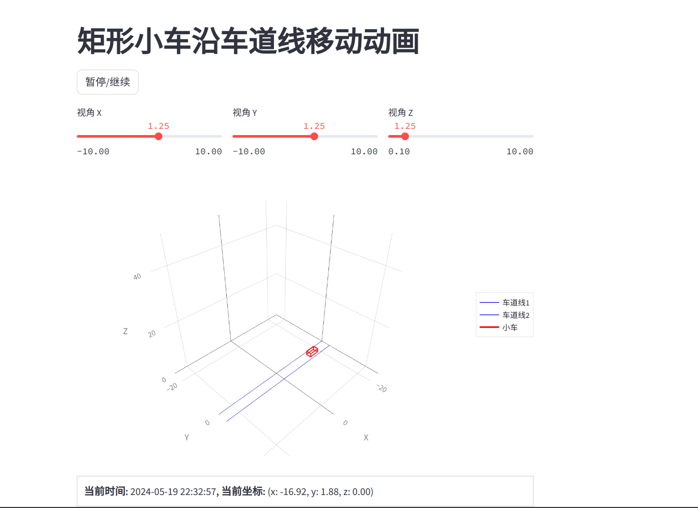

# 使用python的streamlit库作为数据可视化工具
## 官网
https://streamlit.io/
## 安装streamlit
```shell
pip install streamlit
pip install plotly
streamlit hello
```
## 运行此代码
在streamlit_test目录下
```shell
streamlit run main.py
```
## 效果
